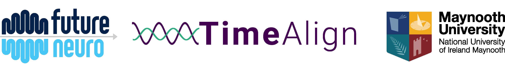
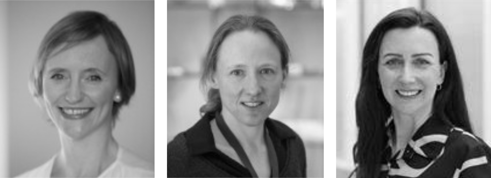

```{r setup, include=FALSE}
knitr::opts_chunk$set(echo = TRUE)
```

&nbsp;  

```{r logo, echo=FALSE, fig.align='center'}

```
<br><br> <!-- Add two line breaks -->


## Study Contacts

&nbsp;  

### Research Team:  

Professor Lorna M. Lopez, Maynooth University  
Dr Cathy Wyse, Maynooth University  
Dr Cristina Ruedell-Reschke, RCSI

&nbsp;  

### Study Contact/Advisor 	
TimeAlign Research Team,  
Department of Biology,  
Callan Building,  
Maynooth University,  
Maynooth,  
Co. Kildare
&nbsp;  

Email:  TimeAlign@mu.ie
Web:    https://www.familygenomics.maynoothuniversity.ie

&nbsp;  

### Maynooth University Ethics Committee
Email		research.ethics@mu.ie 
Phone		(01) 708 6019  
The data processors for this study are the Family Genomics Research Team in Maynooth University.  
The Data Controller for this research project is Maynooth University, Maynooth, Co. Kildare.
&nbsp;  
Maynooth University Data Protection officer can be contacted at 17 Rye Hall Extension, Maynooth University, Co.Kildare  

Maynooth University Data Privacy policies can be found at https://www.maynoothuniversity.ie/data-protection
&nbsp; &nbsp;  
&nbsp; &nbsp;

### Please contact the team anytime if you would like more information about our research
&nbsp;  
Professor Lorna M. Lopez, Maynooth University  
Dr Cathy Wyse, Maynooth University  
Dr Cristina Ruedell-Reschke, RCSI

 

TimeAlign Research Team,  
Department of Biology,  
Maynooth University,  
Co. Kildare.  
TimeAlign@mu.ie  

&nbsp;  

```{r, echo=FALSE, out.width="50%", fig.align='left'}

```

