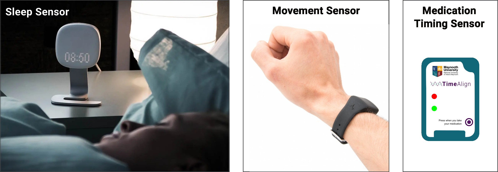

```{r setup, include=FALSE}
knitr::opts_chunk$set(echo = TRUE)
```


```{r logo,fig.align='center', echo=FALSE}
knitr::include_graphics("images/fn_mu_timealign_jpg.jpg")
```

<br><br> <br><!-- Add two line breaks -->

 

&nbsp;   


##  Wrist-Worn and Bedside Sensors Information


Thank you for participating in our research study.  This information sheet will give you full details of how to fit the sensor that you will wear on your wrist, how to use the medication timing sensor and the sensor that will measure sleep and the sleep environment in your bedroom.  The purpose of this is to examine your  circadian rhythms and sleep patterns.   

&nbsp;  

###  What is in the sensor kit?  
You will be given a kit that will contain the following:   

* Wrist straps containing sensors 
* Remote monitoring sensor 
* USB power plugs and cables for fitting the remote monitoring sensors  
* Medication timing sensor

&nbsp;  


<center>  
  
</center>  

<br>


###  What you need to do to fit the wrist sensor  
1. You can wear the sensor on either the left or right wrist, but you must not change this during the study
3.	Please remove the sensor for bathing, showering or swimming but keep it on at all other times including at night
4.	Please try to keep the area around the wrist strap clean and dry
5.	Please monitor your wrist for any signs of skin irritation.  If this happens, please remove and contact us
6.	If you remove the sensor for swimming or taking a shower, and you forget to put it back on, don't worry, just put it back on as soon as you can.  

&nbsp;  

###  What you need to do to fit bedside sensor  

1.	Place the sensor on a table next to the bed. Please ensure the sensor is approximately 40cm from the bed if possible. Please see below for safety information when fitting the sensor.  
2.	Plug in the USB plug and connect to the sensor  
3.	The sensor will record automatically; you do not need to do anything except ensure that it remains plugged in for the duration of the study.  If the sensor is accidently unplugged, then please try to plug it in as soon as you can to avoid data loss  
4.	There is no way that you can tell if the sensor is working, but we will contact you by email if it is not transmitting data to us  

Your safety is very important to us. When fitting the bedside sensor please ensure that you take the following precautions:   

* try to plug the sensor in as close to the wall socket as possible, while still within appropriate range of the bed  
* run the cord/wire along the wall where possible 
* avoid trailing the wire across the room or walkways 
* consider taping the wires to the wall or floor   

&nbsp;  


###  What you need to do to use the medication timing sensor  

1.	Keep the sensor in your pill box/bag or where your store your medication,
2.  When you take your medication, please press firmly on the button, and check that the red light flashes.  This means the time of medication has been logged.  
3.  The green light will flash continuously to indicate that the device is working.
4.  If you forget to press the button, please do not press it later.  Only press the button at the times that you take your medication.
5.  If you have more than one place that you take your medication, we can give you extra sensors.


&nbsp;  

###  What happens next?  
When we receive the equipment back at our laboratory, we will analyse your results.  Please be aware that this is a research study and we do not yet fully understand how the data will relate to health and wellbeing.  If you have any problems or questions, you can always contact the research team on timealign@mu.ie  

&nbsp;  

###  Summary  

* Fit the wrist sensor  
* Fit the bedroom sensor  
* Place the medication sensor with your medication and press the button every time you take a dose
* After 1 week post all equipment back to us in the post-paid envelope.  We will send you an email reminder after one week, when it is time to end the study.   

&nbsp;  

<div align="center"> **Thank you very much for your support with our research** </div>
       
